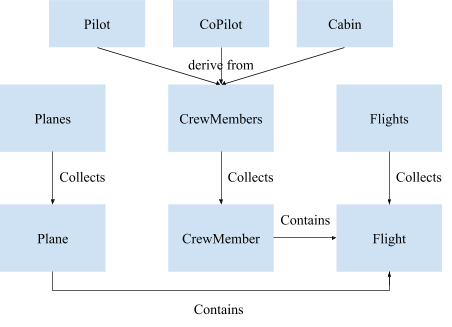

# Flight Tracker
DESCRIPTION: Mean Green Airlines Program. A console-based flight tracker for scheduling pilots, crew members, and flights. Project implemented in C++ for CSCE 1040 Computer Science II course at the University of North Texas as a part of the Texas Academy of Mathematics and Science high school program. This is the final version of my flight tracker program (HW5) out of 3 homework assignments (HW3, HW4, HW5).

AUTHOR: Bryan Ge

EMAIL: bryange@my.unt.edu

COURSE: CSCE 1040 Computer Science II

## Mean Green Airlines Design
### Class Relationships

###	Class Contents
####	Planes Class
private:
- planes map of plane IDs to Plane pointers

public:
- limits for validating user’s values as realistic for respective plane attributes
- minimum number of seats
- maximum number of seats
- minimum range
- maximum range
- minimum number of crew members
- maximum number of crew members
- boolean function that checks if the plane map is empty and returns true when it is
- find plane function which returns the Plane* given a passed in plane ID
- add plane function
- edit plane function
- delete plane function given a passed in plane ID
- search plane function which checks if a plane exists
- print all planes function
- print details for a single plane function
- store function
- load function

####	Plane Class
private:
- string make
- int model
- string ID (plane ID/tail number)
- int numSeats (number of seats on the plane)
- int range (in miles)
- int minCrew (minimum number of crew the plane requires)

public:
- parameterized constructor which takes the passed in make, model, ID, number of seats, range, and minimum number of crew members
- destructor
- print info function
- accessor and mutator functions for plane attributes
- get make
- set make
- get model
- set model
- get ID
- set ID
- get number of seats
- set number of seats
- get range
- set range
- get minimum number of crew members
- set minimum number of crew members

####	CrewMembers Class
private:
- crew members map of crew member IDs to CrewMember pointers

public:
- find function which returns the CrewMember* given the passed in crew member ID
- boolean function which checks if the crew members map is empty
- new crew member function to get information for the specific kind of crew member
- add crew member function
- edit crew member function
- delete crew member function given the passed in crew member ID
- search crew member function which checks if a crew member exists
- print all crew members function
- print details for a single crew member function
- get crew member count function
- store pilot function
- store copilot function
- store cabin crew members function
- store all crew members function
- load pilot function
- load copilot function
- load cabin crew members function
- load all crew members function

####	CrewMember Class
protected:
- string name
- int ID
- string status
- vector<Flight*> flights (holds all the flights the crew member is assigned to)

public:
- parameterized constructor
- destructor
- get crew member type function
- accessor and mutator functions for attributes
- get name
- set name
- get ID
- set ID
- get status
- set status
- virtual print info function

####	Pilot Class
private:
- string rating code
- double cumulative flight hours

public:
- parameterized constructor
- destructor
- get type function
- accessor and mutator functions for attributes
- get rating code
- set rating code
- get flight hours
- set flight hours
- print info function

####	CoPilot Class
private:
- string rating code
- double cumulative flight hours

public:
- parameterized constructor
- destructor
- get type function
- accessor and mutator functions for attributes
- get rating code
- set rating code
- get flight hours
- set flight hours
- print info function

####	Cabin Class
private:
- string position

public:
- parameterized constructor
- destructor
- get type function
- accessor and mutator functions for attributes
- get position
- set position
- print info function

####	Flights Class
private:
- planeIDtoFlightPtrs map with each entry mapping a plane ID to a pointer of a vector of Flight pointers
- crewIDtoFlightPtrs map with each entry mapping a crew member ID to a pointer of a vector of Flight pointers
- flights map of flight IDs to Flight pointers

public:
- find flight function which returns a Flight* given the passed in flight ID
- search flight function which checks to see if a flight exists
- function which finds the vector<Flight*>* from the planeIDtoFlightPtrs map given the passed in plane ID
- function which finds the vector<Flight*>* from the crewIDtoFlightPtrs map given the passed in crew member ID
- validation functions
- boolean function which checks the flight time with the plane being used for the flight
- boolean function which checks the flight time with a crew member assigned to the flight
- boolean function which checks the start/end times of 2 passed in Flight* with a passed in hint specifying if the function is being used to check a plane or crew member
- boolean function which checks if there would be enough seats on the plane given the passed in number of expected passengers and Plane*
- add functions
- add flight function
- add flight to planeIDtoFlightPtrs map function
- add flight to crewIDtoFlightPtrs map function
- add crew member ID to vector of crew member IDs function which has the parameters: a pointer of a vector of crew IDs and a Flight pointer
- edit flight function
- delete functions
- delete flight function
- delete completed and cancelled flights function
- delete flight from planeIDtoFlightPtrs map function
- delete flight from crewIDtoFlightPtrs function
- delete a flight from crewIDtoFlightPtrs function which has the parameters: a pointer of a vector of crew IDs and a Flight pointer
- print functions
- print all flights
- print details of a single flight
- print flights based on status
- print assignment schedule for a plane
- print assignment schedule for a crew member
- store function
- load function

####	Flight Class
private:
- string flightID (flight ID)
- string planeID (ID of plane being used for flight)
- int numPilots (number of pilots)
- int numCopilots (number of copilots)
- int numCabin (number of cabin crew members)
- vector<int>* pilotIDs
- vector<int>* copilotIDs
- vector<int>* cabinCrewIDs
- tm startDateTime (in GMT)
- tm endDateTime (in GMT)
- string startAirportCode (3 letters)
- string endAirportCode (3 letters)
- int numPassengers (number of passengers)
- string status (active, cancelled, completed)

public:
- default constructor
- destructor
- limits for validating user’s values as realistic for respective flight attributes
- minimum year
- maximum year
- minimum month
- maximum month
- minimum day
- maximum day for February when it’s not a leap year
- maximum day for February when it is a leap year
- maximum day for months with 30 days
- maximum day for months with 31 days
- minimum hour
- maximum hour
- minimum minute
- maximum minute
- minimum flight time length
- maximum flight time length
- minimum gap between 2 flights (necessary gap between 2 flights if using the same plane or crew member)
- active status string
- cancelled status string
- complete status string
- 8 hours in seconds (to be used for checking enough amount of pilots, copilots, and cabin crew based on whether or not the flight time length is greater than 8 hours)
- accessor and mutator functions for flight attributes
- get flight ID
- set flight ID
- get plane ID
- set plane ID
- get number of pilots
- set number of pilots
- get number of copilots
- set number of copilots
- get number of cabin crew members
- set number of cabin crew members
- get pilot IDs
- set pilot IDs
- get copilot IDs
- set copilot IDs
- get cabin crew IDs
- set cabin crew IDs
- get start date and time
- set start date and time
- get end date and time
- set end date and time
- get start airport code
- set start airport code
- get end airport code
- set end airport code
- get number of passengers on the flight
- set number of passengers on the flight
- get status
- set status
- set time function with hint specifying if the time being set is for the start date and time or the end date and time
- validation functions
- boolean function for validation of dates and times of a single flight (validate the start is earlier than the end time and that the flight is of a realistic time length)
- boolean function which checks if the passed in year is a leap year
- boolean function to validate that the day of month chosen for the flight time is valid based on the chosen month
- static boolean function to validate 2 flight times
- function that marks flight as completed
- boolean function which returns true if a flight is completed or cancelled
- boolean function which checks if a flight is over 8 hours
- print info function

## Post-Mortem Report
In total, this program took me over 48 hours to write. The creation of these derived classes Pilot, CoPilot, and Cabin taught me how to use the topic of inheritance within my code. Some obstacles that I faced when changing my code to incorporate the new subclasses included identifying the object class types as well as creating the crew member objects using their respective subclasses in relation to the map.

I overcame the obstacle of identifying the type of crew member by using the typeid function and comparing the object to a dummy of the subclasses. This would be used to make sure that the user is presented with the correct fields to complete in terms of adding a crew member, since pilots, copilots, and cabin members all have slightly different data members. By identifying what type of crew member is being added or edited, the program will be able to decide which menus or prompts to print to the user.

I was able to implement the setting and getting of the different data members of the respective subclasses by casting the CrewMember object. This made printing information on each kind of crew member as well as editing very simple and intuitive. Overall, this homework certainly required some changes in my code but the program remained mostly the same.
